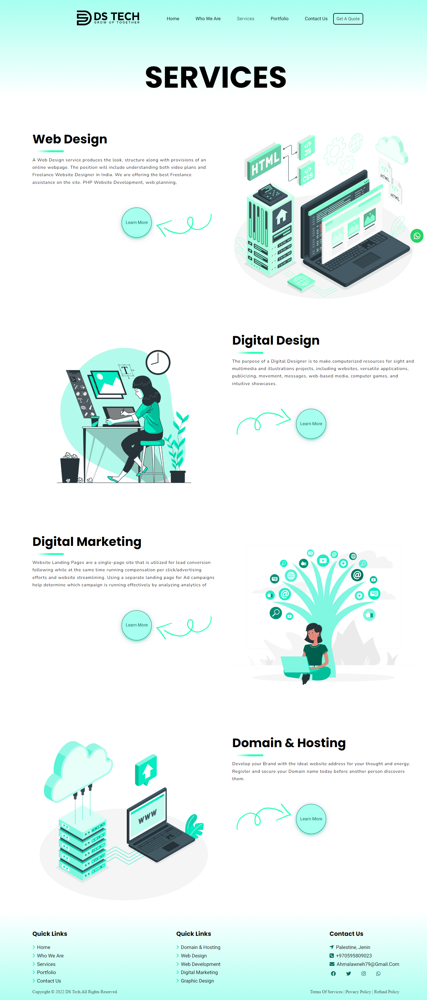

# DS Tech Website
DS Tech Website is a comprehensive web application designed to advance my skills in HTML and CSS. This project represents a personal endeavor for self-improvement in web development.

## Key Features
- **Multipage Structure**: DS Tech Website incorporates multiple pages, including Home, Services, Portfolio, Who We Are, and Contact, ensuring a well-organized and informative user experience.
- **Interactive Home Page**: The home page is crafted to be engaging and interactive, providing visitors with a captivating introduction to DS Tech's offerings.
- **Service Showcase**: Explore the Services page to gain insights into the diverse range of offerings provided by DS Tech.
- **Portfolio Display**: DS Tech Website showcases a portfolio page where the company's notable projects are highlighted, allowing users to evaluate the breadth and quality of their work.
- **About Us Section**: The "Who We Are" page provides an in-depth look into the company's values, mission, and team, fostering transparency and building trust.
- **Contact Form**: Connect with DS Tech seamlessly through the Contact page, featuring a user-friendly contact form for inquiries and feedback.
Experience the DS Tech Difference

Feel free to navigate through the various pages of DS Tech Website to experience its comprehensive structure and functionalities. Your feedback is highly appreciated as I continue to refine and expand upon this project. If you have any questions or suggestions, please don't hesitate to reach out.

**Happy exploring!** 🌐🚀

